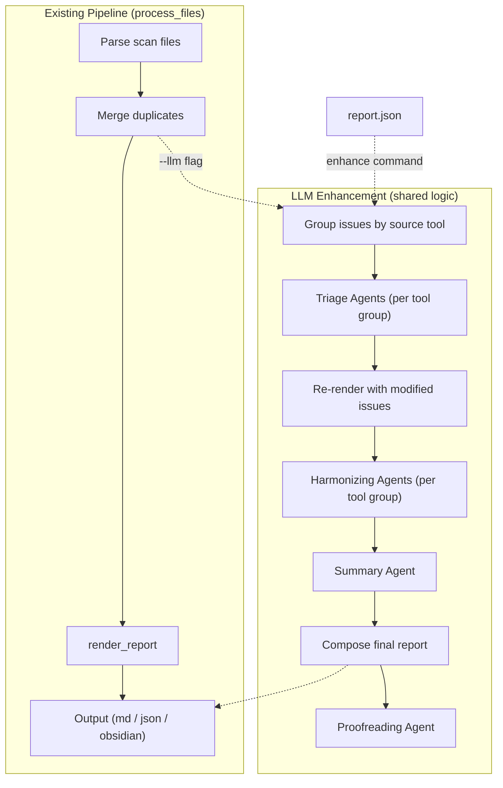
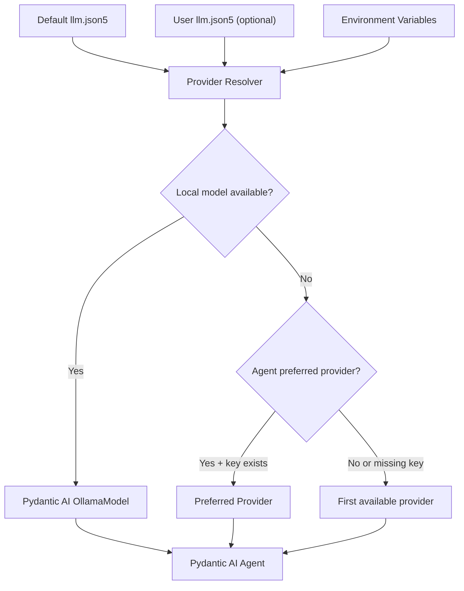

# LLM-Enhanced Report Processing for Magenta

## Architecture Overview

LLM enhancement is available via **two entry points** that share the same underlying logic:

1. **Inline** (`magenta report --llm`): Enhancement runs between the merge and render steps of the existing pipeline, then after render for harmonizing. Output in any format (markdown, JSON, Obsidian).
2. **Standalone** (`magenta enhance report.json`): Operates on a previously generated JSON report. Useful for iterating on LLM settings without re-parsing scan files.




The enhancement logic lives in `[libmagenta/llm/enhance.py](libmagenta/llm/enhance.py)` and accepts the same data structures (`issues` list + `metadata` dict) regardless of entry point.

### CLI Interface

**Inline enhancement:**

```
magenta report scans/ -o report.md --llm [--llm-config CONFIG] [--agents triage,summary] [--clean]
```

**Standalone enhancement:**

```
magenta enhance report.json -o enhanced.md [-f FORMAT] [--llm-config CONFIG] [--agents triage,summary] [--clean]
```

**Flags:**

- `--llm`: Enable LLM enhancement in the report pipeline
- `--llm-config CONFIG`: Path to LLM config file (defaults to `llm.json5` in `MAGENTA_HOME`, then built-in defaults)
- `--agents`: Comma-separated list of agent types to run (default: all). Options: `triage`, `harmonize`, `summary`, `proofread`
- `--clean` / `--no-annotations`: Suppress reviewer notes, dismissed findings section, and change rationale. Produces a "client-ready" report
- `--dry-run`: Show which agents would run, estimated issue counts per group, but don't call the LLM

## Framework and Provider Strategy

### Recommended Framework: Pydantic AI

**Why Pydantic AI over alternatives:**

- **Type-safe structured outputs** -- critical for triage results (severity enums, boolean FP flags, rationale strings). Pydantic AI validates agent outputs against Pydantic models automatically.
- **Clean tool definition** via `@agent.tool` decorators with automatic schema extraction from type hints and docstrings.
- **Provider-agnostic** with built-in support for OpenAI, Anthropic, Google, Ollama. Extended to 100+ providers via `pydantic-ai-litellm`.
- **Minimal abstraction** (~low boilerplate). Fits the project's pragmatic style better than heavier frameworks like LangGraph or CrewAI.
- **Sync execution** via `run_sync()` -- no need to restructure the CLI around async.

**Alternatives considered and rejected:**

- **LangGraph**: Overkill. Graph-based state machines for complex multi-step autonomous workflows. The agents here are essentially structured single-turn or few-turn tasks.
- **CrewAI**: Heavy abstraction layer with opinionated "crew/role/backstory" metaphors. Adds conceptual overhead without matching benefit.
- **smolagents**: Lightweight (~1000 LOC), but lacks Pydantic AI's type-safe structured output validation, which is important for the triage agent's severity/FP decisions.
- **Raw LiteLLM**: Would work for simple prompt-in/text-out, but we'd have to build our own tool-calling protocol and output validation.

**No schema duplication needed:** The existing JSON Schemas (`main.schema.json`, per-template `*.schema.json`) continue to validate parser output via `jsonschema.validate()` unchanged. New Pydantic models are defined only for the **new agent outputs** (TriageResult, etc.) -- these are new data structures with no existing schema equivalent. If migration were ever desired, `datamodel-code-generator` can auto-convert JSON Schema to Pydantic models, but there is no reason to do so now.

### Provider Abstraction Layer




**Provider resolution order:**

1. **Local model** (Ollama): If `OLLAMA_API_BASE` is set or localhost:11434 is reachable, always prefer it. Hard override for security-sensitive deployments.
2. **Agent-preferred provider**: If the agent definition specifies a preference AND the corresponding API key env var exists, use it. (Low priority feature -- signal, not requirement.)
3. **Fallback**: First available provider for which an API key is found, in default order (Anthropic > OpenAI > Google > etc.).

**API keys via environment variables** (standard for each provider):

- `ANTHROPIC_API_KEY`, `OPENAI_API_KEY`, `GOOGLE_API_KEY`, etc.
- `OLLAMA_API_BASE` (defaults to `http://localhost:11434`)
- `OLLAMA_MODEL` (defaults to a sensible general-purpose model)

**Default config file** (`llm.json5` in `MAGENTA_HOME`):

A built-in default ships with the tool (like `DEFAULT_METADATA` does today). Users can override by placing their own `llm.json5` in `MAGENTA_HOME` or by passing `--llm-config`. Config contains model names and preferences only -- no secrets.

```json5
{
    // Default model names per provider (overridable)
    models: {
        ollama: "llama3",
        anthropic: "claude-sonnet-4-20250514",
        openai: "gpt-4o",
    },
    // Per-agent-type preferences (low priority, signal only)
    agent_preferences: {
        summary: {preferred_provider: "anthropic"},
        triage: {preferred_provider: "anthropic"},
    },
    // Context threshold: if total issue tokens < this, include everything
    // in prompt context rather than using tools
    context_threshold_tokens: 4000,
}
```

**New dependencies:**

- `pydantic-ai` -- agent framework
- `pydantic-ai-litellm` -- multi-provider support via LiteLLM
- `pydantic` -- indirect dependency via pydantic-ai

## Agent Definitions

### Grouping Strategy: Per-Tool, Not Per-Category

Rather than an LLM-driven categorization step, issues are grouped by their **source tool** using each tool's own metadata. This eliminates an LLM call and leverages natural tool-domain boundaries.

**The mapping lives in each parser's JSON5 metadata** (e.g., `[parsers/burp/burp.json5](parsers/burp/burp.json5)`), via a new optional `agent_group` field:

```json5
{
    name: "Burp Suite",
    url: "https://portswigger.net/burp",
    description: { en: "...", es: "..." },
    status: "production",
    hidden: false,
    agent_group: "webapp",   // <-- new field
}
```

This keeps the mapping co-located with the tool definition, so it can't go stale. The `SCHEMA_PARSER` in `[libmagenta/engine.py](libmagenta/engine.py)` gets an optional `agent_group` field added. Tools that omit it are assigned to a generic fallback group.

**Defined agent groups:**


| Agent Group        | Tools                                                 | Rationale                                                                                                                                                                                                                                                                                    |
| ------------------ | ----------------------------------------------------- | -------------------------------------------------------------------------------------------------------------------------------------------------------------------------------------------------------------------------------------------------------------------------------------------- |
| **sast**           | Bearer, Bandit                                        | SAST results share characteristics: high false-positive rates, language-specific variants of the same CWE, severity depends on reachability. The agent prompt knows that cross-language duplicates (e.g., `java_lang_sqli` and `ruby_rails_sql_injection`) are the same vulnerability class. |
| **webapp**         | Burp, AttackForge                                     | Scanner-detected web issues need validation. Missing headers are informational. Cookie/session issues need authentication context.                                                                                                                                                           |
| **infrastructure** | Nmap, Nessus, Nikto, Hydra, wafw00f, SSLScan, testssl | Network/infrastructure findings. Small issue counts per tool; grouped to avoid running separate agents for 1 issue each.                                                                                                                                                                     |


Each tool-group agent handles **both** triage and harmonizing for its domain (in two passes), reducing the total number of agent definitions.

### Custom Instructions via Report Metadata

Per-engagement style and content directives are provided via the existing `project.json5` metadata file, in a new optional `llm` section:

```json5
{
    project_info: {
        client_name: "Acme Corp",
        product_name: "Widget Platform",
        // ...
    },
    llm: {
        // Appended to ALL agent system prompts (triage, harmonize, summary, proofread)
        style_instructions: "Never use the word 'attacker'. Always use 'threat actor'. Use formal British English. Avoid contractions.",

        // Appended only to the summary agent's prompt
        summary_instructions: "The client is non-technical and particularly concerned about PCI-DSS compliance. Frame risk in regulatory terms.",

        // Appended only to the harmonizing pass prompt
        harmonize_instructions: "The client prefers short paragraphs. Each recommendation should be actionable in one sentence.",
    },
}
```

The `SCHEMA_METADATA` in `[libmagenta/engine.py](libmagenta/engine.py)` gets an optional `llm` object with optional string fields for each instruction type. These are read by the enhancement pipeline and injected into the relevant system prompts. The global `llm.json5` handles provider/model config; the per-project metadata handles content/style -- clean separation of concerns.

### Agent 1: Tool-Group Agent (SAST / WebApp / Infrastructure)

Each tool-group agent performs two tasks in sequence:

**Pass 1 -- Triage:** Technical review. Adjusts severity, flags false positives, adds reasoning.

Input: All issues from tools in this group (structured data), plus project metadata.

Output (structured, per issue):

```python
class TriageResult(BaseModel):
    vulnid: str
    original_severity: Literal["none", "low", "medium", "high", "critical"]
    adjusted_severity: Literal["none", "low", "medium", "high", "critical"]
    is_false_positive: bool
    rationale: str              # Explanation of any changes
    additional_context: str     # Extra technical notes
```

**Pass 2 -- Harmonizing:** After re-rendering with triage modifications, rewrite the generated prose.

Input: Rendered markdown sections for issues in this group.

Output: Rewritten markdown per issue section (preserving structure: description, details, recommendations subsections).

**System prompt direction per group:**

- **SAST**: Senior application security engineer. Knows SAST tools produce per-language variants of the same CWE. Should consolidate cross-language findings into coherent narrative. Aware that SAST severity depends on data flow reachability, which the tool may not have verified. High false-positive tolerance.
- **WebApp**: Senior web application pentester. Knows scanner findings need manual validation. Should contextualize cookie/header issues relative to the app's authentication model. Aware that "informational" scanner output (robots.txt, server banners) is low-risk but worth noting.
- **Infrastructure**: Senior network security engineer. Knows open ports and cleartext services need context (internal vs internet-facing). Should correlate SSL/TLS issues across hosts. Aware that brute-force results (Hydra) confirm weak credentials but don't represent new vulnerability classes.

**Tools (available to triage pass):**

- `get_issue_details(vulnid: str) -> dict` -- full details of any issue (for cross-referencing)
- `get_cwe_info(cwe_id: str) -> str` -- CWE description and relationships

**Context optimization:** If total token count of issues in the group is below `context_threshold_tokens`, include everything in the prompt directly instead of relying on tools.

### Agent 2: Summary Agent

**Purpose:** Generate an executive summary that contextualizes findings for a non-technical audience.

**Input:** All issues (post-triage), project metadata, severity distribution.

**Output:** Executive summary text (free-form markdown, 2-5 paragraphs).

**System prompt direction:** A CISO-level security advisor writing for executives. Must:

- Characterize the overall security posture -- NOT enumerate issues
- Convey realistic risk in business terms (the "bored teenager vs nation-state" spectrum)
- Consider what the findings say about the target's security maturity
- Account for project context (target type, client, test type) when `project_info` is provided
- Be direct and opinionated -- expert analysis, not template filler

**Custom instructions:** If `metadata.llm.summary_instructions` is provided, it is appended to the system prompt. Combined with `style_instructions` (applied to all agents), this allows per-engagement customization of tone, focus, and terminology.

**Tools:**

- `get_issue_details(vulnid: str) -> dict` -- drill into specific issues
- `get_issues_by_severity(severity: str) -> list[dict]` -- retrieve by severity
- `get_severity_distribution() -> dict` -- counts per severity level

**Context optimization:** Same threshold approach as tool-group agents.

### Agent 3: Proofreading Agent

**Purpose:** Final quality pass over the entire composed report. The human equivalent: a technical writer peer-reviewing the full document end-to-end before delivery.

This is a **distinct concern** from harmonizing:

- **Harmonizing** operates per-tool-group, on individual issue sections in isolation. The SAST agent never sees what the WebApp agent wrote.
- **Proofreading** operates on the **entire composed report** and catches cross-section inconsistencies.

**Input:** The full composed report (markdown), plus `style_instructions` from metadata.

**Output:** Revised full report (markdown). Text-in/text-out, no structured output needed.

**What it checks:**

- Consistency of voice and terminology across sections written by different tool-group agents
- Smooth transitions between sections (summary -> issues -> notes)
- The summary accurately reflecting the details (no contradictions)
- Remaining template artifacts or mechanical phrasing that harmonizing missed
- Grammar, spelling, and readability
- Adherence to `style_instructions` (e.g., the "threat actor" rule)

**No tools needed** for small reports -- single LLM call on the full text.

**Batching for large reports:** If the composed report exceeds the model's context window (or a configurable threshold), the proofreading agent processes the report in overlapping batches of lines. Each batch includes enough overlap with the previous one to maintain continuity and catch cross-boundary inconsistencies. The agent receives the full table of contents / issue list as persistent context so it understands the report structure even when only seeing a slice. This is particularly relevant for local models (Ollama) which typically have smaller context windows than cloud providers.

**Cost note:** For small reports this is a single LLM call. For batched reports, cost scales with the number of chunks. Included in the default agent set but can be skipped with `--agents triage,harmonize,summary`. Automatically skipped if `--clean` is set without explicit `--agents` (since `--clean` implies the user trusts the output and just wants the final product).

## Enhancement Pipeline Detail

### Step 1: Load Issues

- **Inline mode** (`--llm`): Receives `issues` list and `metadata` dict from `process_files` after the merge step.
- **Standalone mode** (`enhance`): Loads JSON report, extracts `issues` and `metadata`. Instantiates `MagentaReporter` with same config for re-rendering.

### Step 2: Group by Tool

Group issues by their source tool's `agent_group` (from parser metadata). Issues from tools with no `agent_group` get a generic fallback agent. Issues produced by multiple tools are assigned to the group of their primary (first-listed) tool.

### Step 3: Triage (parallelizable per group)

For each tool group with issues, run the triage pass. Collect `TriageResult` objects. Apply:

- Update `severity` on issues where `adjusted_severity != original_severity`
- Remove issues flagged as `is_false_positive` (move to "Dismissed Findings" with rationale)
- Store all rationale strings for the "Reviewer Notes" section

### Step 4: Re-render

Call `MagentaReporter.render_report()` with the modified issue list to produce updated markdown sections reflecting severity changes and removed false positives.

### Step 5: Harmonize (parallelizable per group)

For each tool group, run the harmonizing pass on the re-rendered sections. Replace rendered text with harmonized version.

### Step 6: Summarize

Run the Summary Agent with all post-triage issues and metadata. Produces the executive summary.

### Step 7: Compose

Assemble the final report:

1. Header (from re-render, with updated severity counts and chart)
2. Executive Summary (from Summary Agent, replaces the template `summary_table`)
3. Tools section (unchanged)
4. Issues section (harmonized text)
5. Notes section (unchanged)

If `--clean` is **not** set, also include:

1. Dismissed Findings section (false positives with rationale)
2. Reviewer Notes section (all triage changes with rationale, changelog)

A `--clean` flag suppresses items 6-7, producing a client-ready report. Users who want to review agent decisions first can omit `--clean`, inspect the annotations, then re-run with `--clean` (or manually remove the sections).

### Step 8: Proofread (optional)

Run the Proofreading Agent on the fully composed report. This is the final pass before output. Skippable via `--agents` (omit `proofread`) or auto-skipped when `--clean` is set without explicit `--agents`.

## Research Findings: Existing Security Agent Skills

Research into existing security-focused LLM agent tools yielded:

- **AutoPentester** (2025): LLM agent framework for *conducting* automated pentests. Not applicable -- runs security tools, doesn't review reports.
- **Co-RedTeam** (2025): Multi-agent red-teaming framework for *exploiting* vulnerabilities. Same mismatch.
- **T2L-Agent**: Vulnerability localization in source code via LLM + AST analysis. Interesting for SAST triage but too specialized.

**Conclusion:** No off-the-shelf "security report review" agent skills exist. The security LLM ecosystem is focused on *finding* and *exploiting* vulnerabilities, not on *reviewing and contextualizing* report findings. The agents will be built from scratch, relying on LLMs' inherent security knowledge (CWE/OWASP/CVSS training data) combined with carefully crafted system prompts. The domain expertise is in prompt engineering, not reusable components.

## File Structure

New files under `[libmagenta/](libmagenta/)`:

- `[libmagenta/llm/__init__.py](libmagenta/llm/__init__.py)` -- Provider resolver, model configuration, default config loading
- `[libmagenta/llm/agents.py](libmagenta/llm/agents.py)` -- Agent definitions (SAST, WebApp, Infrastructure, Summary, Proofread)
- `[libmagenta/llm/models.py](libmagenta/llm/models.py)` -- Pydantic output models (TriageResult, HarmonizedSection, ExecutiveSummary)
- `[libmagenta/llm/tools.py](libmagenta/llm/tools.py)` -- Tool implementations (get_issue_details, get_cwe_info, etc.)
- `[libmagenta/llm/prompts.py](libmagenta/llm/prompts.py)` -- System prompts for each agent (separate file for easy iteration); supports injection of custom instructions from metadata
- `[libmagenta/llm/enhance.py](libmagenta/llm/enhance.py)` -- Enhancement pipeline orchestration
- `[llm.json5](llm.json5)` -- Default LLM configuration (ships with tool)

Modified files:

- `[libmagenta/engine.py](libmagenta/engine.py)` -- Add optional `agent_group` to `SCHEMA_PARSER`; add optional `llm` section to `SCHEMA_METADATA`
- `[magenta.py](magenta.py)` -- `--llm`, `--llm-config`, `--agents`, `--clean` flags on `report` command; new `enhance` command
- `parsers/*//*.json5` -- Add `agent_group` field to each parser metadata file

## Open Questions and Future Considerations

1. **Token budget management**: Large reports (hundreds of Bearer SAST issues) may exceed context windows. Tool-group agents should handle this via batching or by the context-threshold optimization (tools vs inline context). The threshold should be configurable in `llm.json5`.
2. **Cost control**: `--dry-run` shows what agents would run and estimated token counts. `--agents` selectively enables agent types (e.g., `--agents triage,summary` to skip harmonization). These help users control LLM API costs.
3. **Determinism**: LLM outputs are non-deterministic. Consider caching agent results keyed on input hash, so re-running enhancement on the same report produces the same results unless `--no-cache` is passed.
4. **Language support**: The existing tool supports multiple languages (en, es, etc.). The Summary and Harmonizing agents should respect the `--language` flag and produce output in the specified language. This is handled via system prompt instructions.
5. **Agent preferred provider**: Implemented in the provider resolver but documented as low-priority. The config schema supports it, but the default behavior (local > first available) covers most use cases.
6. **Extensibility for new tools**: When a new parser is added to Magenta, its JSON5 metadata includes `agent_group` to map it to an existing group. If a truly novel tool category emerges, a new agent group can be defined with its own system prompt in `prompts.py` and `agents.py`.
7. **Graceful degradation**: If no LLM provider is available (no API keys, no Ollama), `--llm` should produce a clear error message rather than a silent failure. The `enhance` command should fail fast with actionable instructions.
8. **Autodiscovery for agent definitions**: Currently agent groups are defined in code (3-4 Python classes + prompts). If many custom agent groups emerge, a future version could support autodiscovery from a directory structure (like parsers/templates today). For now this would be overengineering -- the number of agent groups is small and their logic is complex enough to warrant being in code.

