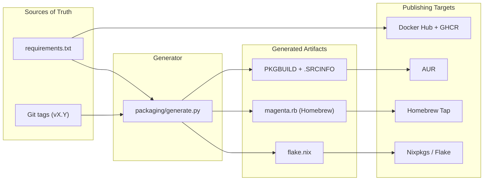

# Multi-Target Packaging for Magenta

## Architecture

All packaging artifacts are generated from two sources of truth:

- `[requirements.txt](requirements.txt)` (+ per-parser `parsers/*/requirements.txt`) for dependencies
- Git tags for versioning (with `libmagenta/__init__.py` `VERSION` as fallback)

A generator script in `packaging/` produces target-specific files. CI workflows consume them.




The Dockerfile reads `requirements.txt` directly at build time and does not need the generator.

## Shared foundation: `packaging/generate.py`

A Python script (since it needs to parse `requirements.txt` with version specifiers, and the project already requires Python) that:

- Reads `requirements.txt`, strips version specifiers to get pip names
- Applies per-distro naming rules with an inline exceptions dict:

```python
  ARCH_EXCEPTIONS = {"jinja2": "python-jinja"}


```

- Accepts a `--target` flag (`arch`, `homebrew`, `nix`) and `--version` argument
- Outputs the generated file to stdout or a specified path
- For Homebrew specifically: shells out to `pip-compile` and/or `homebrew-pypi-poet` to resolve transitive deps and generate `resource` blocks (this is the one step that requires network access and external tools)

This script has no dependencies beyond the Python standard library (except for the Homebrew target, which requires `poet`).

---

## Phase 1: Docker Hub + GHCR

**Scope:** New CI workflow, minor Dockerfile improvements.

**No code changes to Magenta itself.** The existing [Dockerfile](Dockerfile) and [magenta.sh](magenta.sh) wrapper already work.

### CI workflow: `.github/workflows/docker.yml`

- **Trigger:** `workflow_dispatch` only (manual). Accepts an optional `tag` input to control image tagging (defaults to `latest`)
- Later, once verified, add automated triggers: `push` to `main` (`:latest`), `push` tags `v`* (`:X.Y`, `:X.Y.Z`, `:latest`)
- **Steps:** Uses `docker/login-action` (twice: Docker Hub + GHCR), `docker/metadata-action` for tag generation, `docker/build-push-action` for multi-registry push
- **Secrets needed:** `DOCKERHUB_USERNAME`, `DOCKERHUB_TOKEN` (GHCR uses automatic `GITHUB_TOKEN`)
- **Image names:** `golismero/magenta` (Docker Hub), `ghcr.io/golismero/magenta` (GHCR)

### Testing checklist

- Manually trigger the workflow and verify the image is pushed to both registries
- Verify the image runs correctly: `docker run golismero/magenta --version`
- Verify `magenta.sh` works with the published image (update `IMAGE` default)

---

## Phase 2: AUR (stable + `-git`)

**Scope:** Generator support for Arch, CI workflow, two AUR packages.

### Two AUR packages

- `magenta-reporter` -- stable, built from GitHub release tarball
- `magenta-reporter-git` -- bleeding-edge, cloned from `main`

### Generator output: PKGBUILD

The generator produces a PKGBUILD for each variant. Key decisions:

- **Install layout:** `/usr/share/magenta/` for the full project tree (parsers, templates, libmagenta, magenta.py), `/usr/bin/magenta` as a wrapper that sets `MAGENTA_HOME=/usr/share/magenta` and execs Python
- `**arch=('any')`** since it's pure Python
- **Dependencies:** mapped from `requirements.txt` using `python-{pip_name}` with exceptions dict. `python-click-default-group` is an AUR package -- declare it as a dependency (AUR helpers resolve it)
- **Maintainer comment** at the top of the PKGBUILD, hardcoded in generator
- **The `-git` variant** uses a `pkgver()` function that reads the version from git describe

### CI workflow: `.github/workflows/aur.yml`

- **Trigger:** `workflow_dispatch` only (manual). Accepts a `variant` input (`stable` or `git`) to choose which PKGBUILD to generate and push
- Later, once verified, add automated triggers: tags `v`* (stable), push to `main` (git)
- **Runs in an Arch-based container** (e.g., `archlinux:base-devel`) to have access to `makepkg --printsrcinfo`
- **Safeguard:** Run `makepkg --printsrcinfo` and validate output before pushing. Optionally do a test build with `makepkg -s` in a clean environment
- **Pushes to AUR** via SSH (deploy key stored as GitHub secret)
- **Important:** Push to the `master` branch (AUR requirement, not `main`)

### Setup required (manual, one-time)

- Create AUR account, add SSH key
- Clone the two (empty) AUR repos to initialize them
- Add AUR SSH deploy key as a GitHub Actions secret

### Testing checklist

- Build locally with `makepkg -si` in a clean Arch chroot
- Verify the installed `magenta` command runs correctly
- Verify dependency resolution works (especially `python-click-default-group`)
- Verify the `-git` variant's `pkgver()` produces sensible version strings

---

## Phase 3: Homebrew Tap

**Scope:** Generator support for Homebrew, tap repository, CI workflow.

### Separate repository: `golismero/homebrew-magenta`

Contains a single file: `Formula/magenta.rb`

Users install with:

```sh
brew tap golismero/magenta
brew install magenta        # stable
brew install --HEAD magenta # bleeding-edge
```

### Generator output: `magenta.rb`

- Uses `Language::Python::Virtualenv` to create an isolated Python environment
- `resource` blocks for each Python dependency (+ transitive deps) with PyPI tarball URLs and SHA256 hashes -- generated by shelling out to `homebrew-pypi-poet` or equivalent
- `head` block pointing to the git repo for bleeding-edge
- Install step: `virtualenv_install_with_resources`, then install the full project tree to `libexec` and create a `bin/magenta` wrapper via `write_env_script` that sets `MAGENTA_HOME` to `libexec`

### CI workflow: `.github/workflows/homebrew.yml`

- **Trigger:** `workflow_dispatch` only (manual)
- Later, once verified, add automated trigger: tags `v`*
- **Steps:**
  1. Run generator to produce the formula (needs network access for `poet`)
  2. Push the updated formula to the `golismero/homebrew-magenta` repo (using a deploy key or PAT)
- Bleeding-edge (`--HEAD`) doesn't need CI updates -- it always builds from latest `main` by definition

### Setup required (manual, one-time)

- Create `golismero/homebrew-magenta` repo on GitHub
- Add a deploy key or PAT as a GitHub Actions secret

### Testing checklist

- `brew install --build-from-source golismero/magenta/magenta` succeeds
- `brew install --HEAD golismero/magenta/magenta` succeeds
- `magenta --version` works after install
- `brew test golismero/magenta/magenta` passes

---

## Phase 4: Nix Flake

**Scope:** `flake.nix` in-repo, optional nixpkgs PR later.

### In-repo `flake.nix`

Lives at the repo root. Users install/run with:

```sh
nix run github:golismero/magenta -- my_files/ -o report.md
```

This is inherently bleeding-edge (always builds from whatever ref the user points at).

### Generator output: `flake.nix`

- Uses `python3Packages.buildPythonApplication` with `format = "other"` (since there's no setup.py/pyproject.toml)
- Dependencies mapped from `requirements.txt` using pip names as-is (Nix attribute names match)
- `installPhase` copies the project tree to `$out/share/magenta` and creates a wrapper via `makeWrapper` that sets `MAGENTA_HOME`
- The flake also exposes a `devShell` for contributors

### Versioning

- The `flake.nix` is committed to the repo. Since it references `self` as the source, it doesn't need hash updates -- it's always current
- For tagged releases / nixpkgs, the derivation uses `fetchFromGitHub` with a pinned hash (that would go in a nixpkgs PR, not in the in-repo flake)

### `flake.lock`

- Generated by running `nix flake lock` and committed. Updated as needed

### Testing checklist

- `nix build` succeeds in the repo root
- `nix run . -- --version` works
- `nix flake check` passes
- Test on both NixOS and non-NixOS systems with Nix installed

---

## Phase 5: Debian (APT repo via GitHub Pages)

**Scope:** Generator support for Debian packaging, CI workflow to build `.deb` and publish to a self-hosted APT repo. Kali submission deferred -- having a working `.deb` and APT repo makes that easier when the time comes.

### APT repo hosted on GitHub Pages

A separate repository `golismero/apt` (or a `gh-pages` branch) serves as the APT repo. Users install with:

```sh
# Add GPG key
curl -fsSL https://golismero.github.io/apt/gpg.key | sudo gpg --dearmor -o /usr/share/keyrings/magenta-archive-keyring.gpg

# Add repository
echo "deb [signed-by=/usr/share/keyrings/magenta-archive-keyring.gpg] https://golismero.github.io/apt stable main" \
  | sudo tee /etc/apt/sources.list.d/magenta.list

# Install
sudo apt update
sudo apt install magenta-reporter
```

The repo is managed with `reprepro`, which handles the pool/dists structure, package indexing, and GPG signing.

### GPG signing

APT repos must be GPG-signed for `apt` to trust them. This requires:

- A dedicated GPG key pair for signing the repo
- The private key stored as a GitHub Actions secret (`GPG_PRIVATE_KEY`, `GPG_PASSPHRASE`)
- The public key published at `https://golismero.github.io/apt/gpg.key`

### Generator output: `debian/` directory

The generator produces the following files:

- `**debian/control**` -- package name (`magenta-reporter`), architecture (`all`), dependencies mapped from `requirements.txt` using the `python3-{pip_name}` rule (100% consistent, no exceptions needed), description, homepage, maintainer
- `**debian/rules**` -- minimal, since there's no compilation. Uses `dh` with a custom install step that copies the project tree to `/usr/share/magenta/` and creates the `/usr/bin/magenta` wrapper
- `**debian/install**` -- maps source files to destination paths: `magenta.py`, `libmagenta/`, `parsers/`, `templates/` all go to `/usr/share/magenta/`
- `**debian/changelog**` -- generated from the version (git tag or input), required by `dpkg-buildpackage`
- `**debian/copyright**` -- Apache-2.0, references the upstream LICENSE file
- `**debian/compat**` -- debhelper compatibility level (13)

### Install layout (follows Debian FHS conventions)

- `/usr/share/magenta/` -- full project tree (magenta.py, libmagenta/, parsers/, templates/)
- `/usr/bin/magenta` -- wrapper script that sets `MAGENTA_HOME=/usr/share/magenta` and execs `python3 /usr/share/magenta/magenta.py "$@"`

### CI workflow: `.github/workflows/debian.yml`

- **Trigger:** `workflow_dispatch` only (manual)
- Later, once verified, add automated trigger: tags `v`*
- **Runs in a Debian-based container** (e.g., `debian:bookworm`) with `dpkg-dev`, `debhelper`, `reprepro`, and `gpg` installed
- **Steps:**
  1. Run generator to produce `debian/` files
  2. Build `.deb` with `dpkg-buildpackage -us -uc` (unsigned source/changes, the repo itself is signed)
  3. Clone the APT repo (GitHub Pages repo)
  4. Add the `.deb` to the repo using `reprepro includedeb stable <package>.deb`
  5. Sign the repo metadata with the GPG key
  6. Push the updated repo back to GitHub Pages
  7. Also upload the `.deb` as a GitHub Release artifact for direct download

### Debian version targeting

- Target **bookworm** (current Debian stable) and newer. All required Python dependencies (`python3-click`, `python3-click-default-group`, `python3-jinja2`, `python3-json5`, `python3-jsonschema`, `python3-matplotlib`, `python3-pygments`, `python3-rich`, `python3-babel`) are available in bookworm
- Kali is based on Debian testing, so a bookworm-compatible package works there too

### Setup required (manual, one-time)

- Create `golismero/apt` repo on GitHub with GitHub Pages enabled
- Generate a GPG key pair for repo signing
- Add `GPG_PRIVATE_KEY` and `GPG_PASSPHRASE` as GitHub Actions secrets
- Export and commit the public key to the Pages repo as `gpg.key`
- Initialize the `reprepro` config in the Pages repo (`conf/distributions` file)

### Testing checklist

- Build the `.deb` locally in a Debian container and verify it installs cleanly with `dpkg -i`
- Verify `apt install magenta-reporter` works from the GitHub Pages APT repo
- Verify the `magenta` command runs correctly after install
- Verify dependency resolution works (all deps pulled from Debian repos)
- Test on both Debian bookworm and Kali

---

## Future: Kali submission

Not part of this implementation. When the time comes:

- File a tool addition request on [Kali's bug tracker](https://bugs.kali.org/)
- Having a working `.deb` with proper `debian/` packaging makes the submission much stronger
- Kali's team may adopt the packaging or work with you on it

---

## Files to create/modify


| File                             | Action                                               | Phase                       |
| -------------------------------- | ---------------------------------------------------- | --------------------------- |
| `packaging/generate.py`          | Create                                               | Foundation (before Phase 2) |
| `.github/workflows/docker.yml`   | Create                                               | Phase 1                     |
| `.github/workflows/aur.yml`      | Create                                               | Phase 2                     |
| `.github/workflows/homebrew.yml` | Create                                               | Phase 3                     |
| `flake.nix`                      | Create                                               | Phase 4                     |
| `.github/workflows/debian.yml`   | Create                                               | Phase 5                     |
| `magenta.sh`                     | Modify `IMAGE` default to `golismero/magenta`        | Phase 1                     |
| `.dockerignore`                  | Possibly add `packaging/`, `flake.nix`, `flake.lock` | Phase 1                     |


